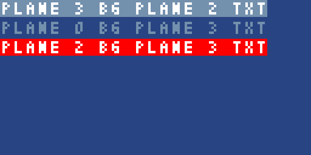
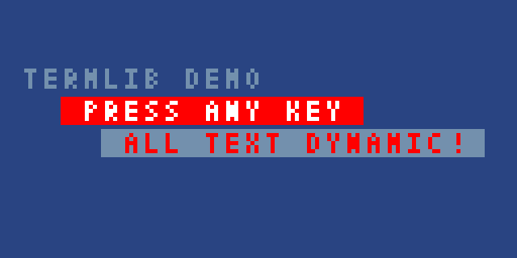
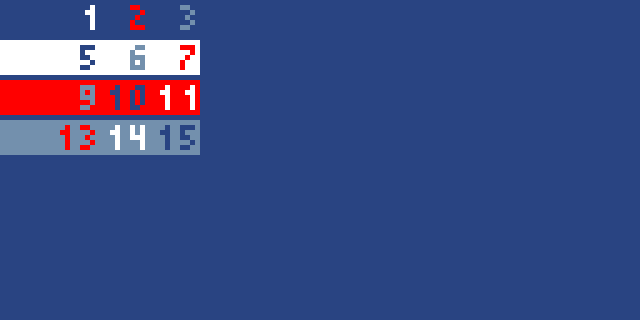

# octo-termlib

**TL;DR**: A terminal-inspired text rendering library for XO-CHIP.


There's [an interactive demo on itch.io](https://pushfoo.itch.io/termlib-demo).
The project was initially written as an [Octojam 10](https://itch.io/jam/octojam-10)
entry.


It supports notions of foreground and background. This code produces
the output below it:

```
: message_string
    text "^B3^F2"
	text "PLANE 3 BG PLANE 2 TXT\n"
    text "^D"  # Reset the colors
    text "PLANE 0 BG PLANE 3 TXT\n"
	text "^B2" # Set BG plane to 3
	text "PLANE 2 BG PLANE 3 TXT\0" # \0 ends the message.
```


Colors depend on your current XO-CHIP color palette.


## Table of contents

1.  [Why build this?](#why-build-this)
2.  [How does it work?](#how-does-it-work)
3.  [Is it fast?](#is-it-fast)
4.  [Syntax Details](#syntax-details)
5.  [Design goals](#design-goals)
6.  [Current limitations](#current-limitations)
7.  [Inspiration](#inspiration)

## Why build this?

I wanted:

1.  A quickstart tool for rendering text in Octo projects
2.  A configurable renderer to help restart work on
    [Fontknife](https://github.com/pushfoo/Fontknife), another project
    of mine
3.  To learn about text formatting and rendering on low-resource and
    retro platforms

Bash's color escapes are not the tool I was looking for:

1.  Bash-style color escapes are hard to read:

    | Bash-style escape                | octo-termlib syntax           |
    |----------------------------------|-------------------------------|
    | `\e[37mLight gray foreground\]`  | `^F1Light gray foreground^D`  |
    | `\e[41mRed background\]`         | `^B2Red background^D`         |
    | `\e[41m\e[37Both colors\]\]`     | `^B2^F3Both colors^D`         |

2.  [Octo\'s `:stringmode` macro](https://johnearnest.github.io/Octo/docs/Manual.html#strings)
    does not support `\e`
3.  Substituting another escaped character would make them harder to
    read
4.  The substituted codes would end up using even more space than they
    already do.
5.  Processing them would be harder to implement in Octo.

## How does it work?

**TL;DR**: It reads certain character combinations as formatting control
instead of drawing them as sprites.

Let's use the title screen from the demo above as an example. With the
library, drawing the formatted text on it consists of the following:

1.  Declare the following label:

    ```
    : msg_title

       text "\n\n"
       text "^F3^B0 COLOR LIB DEMO \n"
       text "     ^F3^B2 PRESS ANY KEY ^D\n"
       text "       ^F1^B3 ALL TEXT DYNAMIC!\0"
    ```

2.  Call the drawing routine:
 
    ```
    show-msg 0 0 msg_title
    
    # Wait for input to allow observing the text
    v0 := key
    ```

The result:


Every `^` starts an escape sequence which changes the drawing planes
instead of rendering as text. Some set non-default colors, while others
restore defaults.


The second screen shows off the full range of color combinations by
using the following syntax:

```console
: msg_all
   text "^F0^B0 0^F1^B0 1^F2^B0 2^F3^B0 3\n"
   text "^F0^B1 4^F1^B1 5^F2^B1 6^F3^B1 7\n"
   text "^F0^B2 8^F1^B2 9^F2^B210^F3^B211\n"
   text "^F0^B312^F1^B313^F2^B314^F3^B315\0"
```

The result:


## Is it fast?

**TL;DR**: Fast enough for most use cases with plenty of room for
optimizations.

The demo embedded on this page runs at 100 instructions / cycle. It will
run smoothly down to 30 instructions / cycle. After that point, pauses
from string parsing become will grow more noticeable.

Since there is a lot of room for optimization, it is unclear what the
minimum instruction / cycle will be.

## Syntax Details

**TL;DR**: \"What if Bash color escapes were better?\"

The `^` character enters escape mode. To save CPU cycles and memory,
there is no closing tag and no stack. Instead, effects are applied
immediately. You can restore defaults by either binding them to a string
to draw, or use the dedicated shortcut:

| Name           | Escape code | Action(s)                                                                                   |
|----------------|-------------|---------------------------------------------------------------------------------------------|
| **D**efaults   | `^D`        | <ol><li>Set `bg_color` to `0` invisble.</li><li>Set `fg_color` to `3` (Full color)</li><ol> |
| **B**ackground | `^BN`       | Set the draw plane(s) for the flat character used to color the background layer             |
| **F**oreground | `^FN`       | Set the draw plane(s) for the foreground layer.                                             |

### As Regex

**TL;DR**: There are interactive regex playgrounds linked below.

| Regex Flavor           | Regex101 Link                             | Rough expression                       |
|------------------------|-------------------------------------------|----------------------------------------|
| ECMAScript/JavaScript  | [Try it](https://regex101.com/r/0366WB/)  | `/(\^(?<action>[A-Z])(?<num>\d?)+)/`   |
| Python                 | [Try it](https://regex101.com/r/4upDdM/)  | `r'\^(?P<action>[A-Z])(?P<num>\d)?'`   |

## Current Limitations

**TL;DR**: There are a lot of brittle assumptions and no way to keep
`vF` results.

The drawing layers imitate the concepts of other systems by using double
length sprites compatible with `plane 3`. Font data is expected to match
this standard. This is how the second screen generates all its color
combinations: XO-CHIP\'s XOR-based allows effects like stenciling shapes
out of single-color surfaces.

Despite its potential, the current implementation is currently
incomplete in ways which limit its use for more demanding tasks. Some of
the most important examples are outlined below.

| Current Implementation                                    | Limitation                                                         |
|-----------------------------------------------------------|--------------------------------------------------------------------|
| No form of error handling in any shape                    | Bad input can break non-debugger status displays.                  |
| One message position stored at time without caching       | Library best used for predictable state such as JRPG text boxes    |
| Assumes monospace fonts                                   | Unexpected character sizes will not render highlighting correctly. |
| Layer draw calls skip if their `plane` is 0               | Inconsistent timing if plane values change                         |
| Storing `vF` from successive draw calls is unimplemented  | Can\'t detect XOR collisions while batch drawing text              |

See the following to learn more:

-   The [Inspiration](inspiration) heading below
-   The [XO-Chip documentation](http://johnearnest.github.io/Octo/docs/XO-ChipSpecification.html#bitplanes)

### Planned Additions

| Tentative Example        | Meaning                                       | Intended Purpose                    |
|--------------------------|-----------------------------------------------|-------------------------------------|
| `text "^R5^C5example"`   | Jump drawing cursor to row 5, column 5        | Replacing or deleting specific characters |
| `text "^X51^Y23example"` | Move the drawing cursor to screen pixel 51,32 | Fast kerning experimentation.       |
| `text "^E3"`             | XOR entire screen with pixels using `plane 3` | Change / flash colors for errors    |

Future features could also include:

-   Caching of rendered glyphs to speed up XOR-erasing specific parts
-   Limited UI / widget features

## Design goals

**TL;DR**: Imitate some old terminal behaviors but with quality of life
improvements.

The CHIP-8 instruction set was originally designed for 1970s kit
computers. This hardware was extremely limited, even when compared to
the era\'s terminals and more some recent household appliances. For
example, these kit computers:

-   ran at less than 2 MHz
-   came with less than 2 KB of RAM

Systems from this era made the most of their limited resources by
reserving [control characters](https://en.wikipedia.org/wiki/Control_character) for
communication and markup, as well as using [escape characters](https://en.wikipedia.org/wiki/Escape_character)
to indicate changes in encoding.

Since control characters are often represented with [caret notation](https://en.wikipedia.org/wiki/Caret_notation), this library
re-uses it as a convenient default escape character. However, the final
value is not converted to a byte literal but left as an ASCII `^`.

[octo-debugger-doc]: https://johnearnest.github.io/Octo/docs/Manual.html#debugging

It has numerous advantages:

1.  It works with the limitations of Octo\'s `:stringmode` macros
    without sacrificing any clarity
2.  Combining styles is far more legible:
3.  It\'s easier to implement in Octo
4.  It renders cleanly in [Octo\'s debugger](#octo-debugger-doc),
    unlike unprintable byte literals
5.  The resulting escapes are easier to distinguish than hex codes
6.  It\'s easier to enter than hex codes

Aside from wasting bytes, there seem to be few downsides, especially if
you are still prototyping. The `^` character seems to generally be
unused in Octo projects due to poor legibility in pixel fonts,
especially at the supported screen resolutions.

## Inspiration

-   [rich](https://github.com/Textualize/rich), a Python terminal
    formatting library
-   Control & drawing behaviors from specific systems:
    -   [Control codes used in teletext systems from same era as
        CHIP-8](https://en.wikipedia.org/wiki/C0_and_C1_control_codes#Modified_C0_control_code_sets)
    -   The [Varvara VM\'s dual-layer screen
        device](https://wiki.xxiivv.com/site/varvara.html#screen)
    -   Python\'s [history of multiple string formatting
        techniques](https://docs.python.org/3/tutorial/inputoutput.html#fancier-output-formatting)
